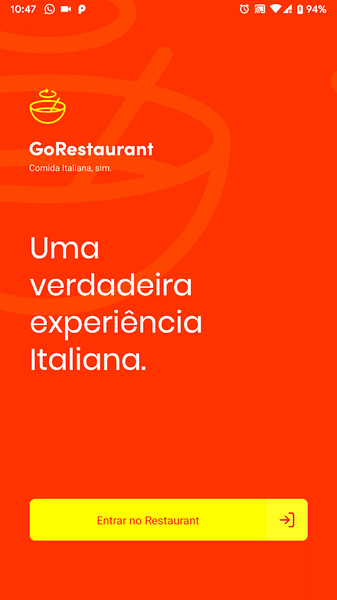

<div align="center">
  
</div>

<br>
<br>

<h1 align="center"> 📱🥘 GoRestaurant mobile 🥘📱 </h1>

<div align="center">
Application developed for the challenge 11 of Bootcamp Gostack.
<br>


" alt="license" />
</div>


<p align="center">
 <a href="#about">About</a> |
 <a href="#technologies">Technologies</a> |
 <a href="#run">How to run</a> |
 <a href="#license">License</a> |
 <a href="#autor">Autor</a>
</p>

<br/>

## 💻 Preview
<div align="center">
  
  
</div>

<br/>

<div id="about">

## The challenge
In this challenge it was proposed to create some features for the mobile version of the GoRestaurant; this is the user's view of the application. Among the functions of the application are the possibility to list and filter food dishes and allow the creation of new orders. <br> The app was built with React Native along with TypeScript.

</div>

<br>

## 📎 Features
- [x] List the food dishes
- [x] List the categories
- [x] Filter food dishes by category
- [x] List ordes
- [x] List the favorite food dishes
- [x] Place an order for a dish

<br>

<div id="technologies">

## 🛠 Technologies
The following tools were used to solve this challenge:
- [React Native](https://reactnative.dev/)
- [TypeScript](https://www.typescriptlang.org/)
- [Axios](https://github.com/axios/axios)
- [styled-components](https://styled-components.com/)
- [Jest](https://jestjs.io/)

</div>

<br>

<div id="run">

## ℹ How to run

### Requirements

Before you start, you will need to install the following tools:
- [React Native](https://reactnative.dev/)
- [Yarn](https://yarnpkg.com)
- [Git](https://git-scm.com)

Clone the repository and install the dependencies:

```bash
# To clone the repository
$ git clone https://github.com/cesarramos95/gostack-gorestaurant-mobile

# To acess the folder
$ cd gostack-gorestaurant-mobile

# Installing all dependencies
$ yarn

# To run fake API
$ yarn json-server server.json -p 3333
```

To run the application on your mobile device you need to configure your IP on [api.ts](./src/services/api.ts) file:

```shell
baseURl: "http://<your machine's ip>:3333"
```
Or

```shell
baseURL: "http://localhost:3333"
```
In this last case, run the command below:

```shell
adb reverse tcp:3333 tcp:3333
```
</div>

<div id="license">

---

## 📝 License
This repository is under [MIT](./license) license.
</div>

<div id="autor">

## Autor


<br>
<a href="t.me/cesarramos95">César</a>

[](https://www.linkedin.com/in/cesararamos/)
[](mailto:cesarramos.aug@gmail.com)

</div>

---

Made with ❤ by César 👋 [Get in touch!](https://linkedin.com/in/cesararamos)

